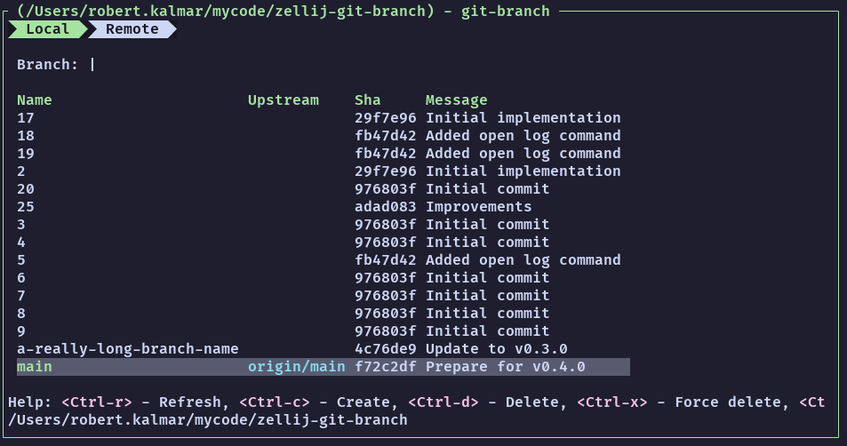

# zj-git-branch
Zellij plugin for managing git branches



## Installation

Download the latest binary from the releases pages and start the plugin with the `zellij plugin` command.

```bash
zellij plugin --floating -- ./target/wasm32-wasip1/release/zellij-git-branch.wasm
```

The url of the release artifact can also be passed to the `zellij plugin` command.

```bash
zellij plugin --floating -- https://github.com/dam4rus/zj-git-branch/releases/download/v0.1.0/zellij-git-branch.wasm
```

## Contributing

Feel free to open issues for feature requests or create PRs for bug and other fixes.

## User guide

The plugin uses the current directory as the git repository. In case a different repository needs to be managed, the plugin should be closed and reopened at the directory of another git repository. Zellij's pipe command can also be used to switch the current directory of the plugin:

```bash
zellij pipe --plugin https://github.com/dam4rus/zj-git-branch/releases/download/v0.1.0/zellij-git-branch.wasm --name cwd "/path/to/directory"
```

### Selecting a branch

Up and down arrow keys can be used to select a branch from the list.

### Filtering branches

Filter branches by simply typing the branch's name.

NOTE: At the moment the branches are filtered if their name does not starts with the input. This will change in the feature to be more intelligent.

### Switching to a branch

Pressing `enter` will switch to the selected branch. An error will be displayed if switching has failed for some reason.

### Creating a branch

Pressing `ctrl+c` will create a branch with the input field's value as it's name.

### Refreshing branch

Branches can be reloaded with `ctrl+r`

### Deleting a branch

The selected branch can be deleted by pressing `ctrl+d`. If the branch cannot be deleted an error will be displayed. A branch can be force deleted with `ctrl+x`

### Open log

Open the log for the selected branch with `ctrl+l`. How to open the log can be configured. See [Configuration](#configuration)

## Configuration

The following configuration options can be provided to the plugin

| argument             | type   | description                                                |
|----------------------|--------|------------------------------------------------------------|
| open_log_in_floating | bool   | Controls whether to open the log in a floating pane or not |
| log_args             | string | Additional arguments to pass when opening the log pane     |
